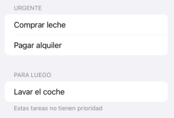

# SwiftUI: modelos, listas y navegación

En la sesión anterior vimos los elementos más básicos de SwiftUI y una idea central al *framework* que es la vista como función del estado. Vimos que el estado se puede definir en las vistas con `@State` pero esta no es una solución escalable para aplicaciones con un estado complejo. Aquí vamos a ver cómo podemos almacenar estado que persista durante toda la vida de la aplicación aunque vayamos cambiando entre vistas, que sea accesible por todas ellas y cómo navegar entre vistas.

## 1. El modelo en SwiftUI

La mayoría de aplicaciones complejas tienen un estado complejo, con muchos datos que probablemente queremos hacer accesibles a varias vistas. En lugar de ir definiendo este estado variable a variable con `@State` dentro de las vistas es mejor definir uno o varios modelos, clases que almacenen el estado de la app e implementen la lógica de negocio. En SwiftUI podemos hacer que esas clases sean "reactivas", es decir que los cambios actualicen automáticamente la UI simplemente anotándolas con la macro `@Observable`.

### Definir el modelo

Por ejemplo, supongamos que queremos hacer una app para gestionar nuestra lista de la compra. Aquí tendríamos una versión inicial de nuestro modelo en la que cada elemento de la lista (cada `Item`) simplemente tiene un nombre: "pan", "patatas", ... y de momento solo podemos añadir un nuevo item a la lista.

```swift
struct Item {
    let nombre : String
}

class ListaModel {
    var items: [Item] = []
    
    func addItem(nombre: String) {
        let new = Item(nombre: nombre)
        items.append(new)
    }
}
```

### Convertir el modelo en observable

El modelo anterior tiene un problema y es que usado junto con `@State` para asociarlo a la vista, no nos asegura que SwiftUI vaya a actualizar la vista automáticamente al cambiar el modelo, al ser éste una clase y por tanto en Swift un tipo por referencia. Ya vimos que `@State` no funcionaba bien con tipos por referencia. 

Esta sería una interfaz muy simplificada, con un campo de texto para escribir el nombre del producto, un botón para añadirlo, y una subvista para mostrar el total de items. Dejaremos el mostrar la lista para un apartado posterior, ya que es algo más complicado.

```swift
struct ListaCompraView: View {

    @State private var model = ListaModel()
    @State private var nuevoItem = ""

    var body: some View {
        VStack {
            CuentaView(model: model)
            TextField("Nuevo producto", text: $nuevoItem)
            Button("Añadir") {
                guard !nuevoItem.isEmpty else { return }
                model.addItem(nombre: nuevoItem)
                nuevoItem = ""
            }
        }
    }
}

struct CuentaView : View {
    let model : ListaModel
    var body : some View {
        Text("Hay \(model.items.count) productos")
    }
}
```

Si probamos la aplicación veremos que el número de productos no se actualiza al añadir nuevos, ya que SwiftUI no detecta el cambio en el array `items` y por tanto no ve la necesidad de repintar `CuentaView`. Para solucionar el problema, a partir de iOS17 podemos usar la macro `@Observable` para anotar la clase del modelo que queremos hacer "reactiva" a cambios. De este modo SwiftUI reaccionará automáticamente a cualquier cambio en los valores del modelo. 

Aprovechamos para imprimir en la consola la lista de la compra cada vez que añadimos un item ya que no tenemos una interfaz para mostrarla.

```swift
//necesario para @Observable
import Observation

//igual que antes
struct Item {
    let nombre : String
}

@Observable //Único cambio
class ListaModel {
    var items: [Item] = []
    
    func addItem(nombre: String) {
        let new = Item(nombre: nombre)
        items.append(new)

        print("🛒 Lista actual:")
        items.forEach { print("- \($0.nombre)") }
    }
}
```

Ahora la aplicación ya funcionará correctamente, mostrando el número de productos en la UI y de momento la lista solo por la consola.

!!! Note "SwiftUI y MVVM"
    Si conoces el patrón de diseño MVVM (Model/View/View Model) te habrás dado cuenta de que se parece bastante a lo que acabamos de comentar. No obstante, al contrario de lo que sucedió con UIkit, donde Apple "abrazó" completamente el patrón de diseño MVC, referenciándolo constantemente en su documentación, con SwiftUI ha evitado referenciar MVVM en la documentación oficial pese a que el paralelismo entre los `@Observable` de SwiftUI y los "View Model" de MVVM es más que evidente. La cuestión es que siendo "MVVM-ortodoxos" deberíamos implementar además uno o varios "Model", que serían clases Swift que encapsulan el estado y la lógica de negocio de manera independiente de la UI, mientras que los *view models* contienen solo el estado que queremos mostrar en la UI más cuestiones adicionales como estados de carga ("cargando", "error",...) . Sin embargo, no hay una forma oficial sancionada por Apple de implementar esto, así que puedes organizar tu código en este sentido como mejor te parezca y simplemente olvidarte de MVVM.

### Propiedad del modelo: quién lo crea y cuánto "vive"

Una vez que tenemos un modelo observable, la siguiente pregunta clave es **dónde se crea ese modelo y quién es su propietario**. Esto determina **cuánto tiempo vive** y **qué vistas pueden acceder a él**.

#### Modelo poseído por una vista (`@State`)

Este es el caso que hemos visto hasta ahora. Cuando una vista **crea y es propietaria** del modelo, lo habitual es almacenarlo como `@State`. Esto hace que la instancia del modelo:

* Se cree una sola vez mientras la vista esté viva
* Se mantenga entre repintados de la vista
* Se destruya cuando la vista desaparece definitivamente

En nuestro ejemplo,  `ListaCompraView` es claramente la **dueña del modelo**. Otras vistas no pueden acceder a él a menos que se lo pasemos explícitamente, como hacemos con `CuentaView`.

Este patrón es adecuado cuando:

* El estado pertenece conceptualmente a una pantalla concreta
* No necesitamos compartirlo con muchas vistas no relacionadas


#### Modelo compartido por toda la app (`@Environment`)

En aplicaciones reales suele interesar que ciertos datos **persistan durante toda la vida de la aplicación**, aunque naveguemos entre vistas. En SwiftUI esto se consigue **inyectando el modelo en el entorno**.

Normalmente esto se hace en el punto de entrada de la app:

```swift
@main
struct ListaCompraApp: App {
    @State private var model = ListaModel()

    var body: some Scene {
        WindowGroup {
            ListaCompraView()
                .environment(model)
        }
    }
}
```

A partir de ese momento, **cualquier vista del árbol** puede acceder al modelo usando:

```swift
@Environment(ListaModel.self) var model
```

Por ejemplo:

```swift
struct CuentaView: View {
    @Environment(ListaModel.self) var model

    var body: some View {
        Text("Items: \(model.items.count)")
    }
}
```

Este patrón es adecuado cuando:

* El estado representa datos “globales” de la app
* Queremos evitar pasar el modelo manualmente por muchas vistas intermedias
* El modelo debe sobrevivir a la navegación


### Inyección y edición del modelo en vistas hijas (`@Bindable`)

Normalmente una vista no trabaja sola. Es habitual que una vista hija necesite no solo leer sino también **modificar** un modelo que pertenece a otra vista o que viene del entorno.

Supongamos que una vista raíz crea el modelo y lo pasa a una vista hija:

```swift
struct ListaCompraView: View {
    @State private var model = ListaModel()

    var body: some View {
        //Esta vista muestra la lista en pantalla, y permite editarla
        ListaItemsView(model: model)
    }
}
```

La vista hija recibe el modelo, pero **no es su propietaria**. Si necesita poder modificarlo y que esos cambios se reflejen en la UI tenemos que pasar el modelo de otra manera.

Cuando una vista **recibe un modelo observable** y va a modificar directamente sus propiedades, debe declararlo como `@Bindable`:

```swift
struct ListaItemsView: View {
    @Bindable var model: ListaModel

    var body: some View {
        //Aqui listaríamos los items y pondríamos botones para editar, eliminar...
    }
}
```

Esto es el equivalente conceptual a `@Binding`, pero aplicado a **objetos observables completos** en lugar de structs o valores simples.


## 2. Listas (`List`)

En UIKit el componente típico para mostrar datos es el `UITableView`. En SwiftUI es **`List`**. La principal diferencia es que no necesitamos implementar métodos para decir cuántas filas hay o qué celda cargar: simplemente le pasamos la colección de datos y una clausura que define cómo se ve cada fila.

### Listas estáticas    

Al igual que en UIKit existen las tablas estáticas con filas fijas, en SwiftUI también podemos poner elementos fijos en una colección, que no están generados dinámicamente. Podemos dividir la lista en secciones que aparecerán visualmente separadas del resto:

```swift
//Fijaros en el estilo más que en el contenido del ejemplo, 
//en la realidad estas tareas no serían fijas, sino sacadas de una BD
List {
    Section(header: Text("Urgente")) {
        Text("Comprar leche")
        Text("Pagar alquiler")
    }
    
    Section(header: Text("Para luego"), footer: Text("Estas tareas no tienen prioridad")) {
        Text("Lavar el coche")
    }
}
```

La lista anterior tendría un aspecto similar al de esta figura:




### Listas dinámicas simples

#### Requisito: El protocolo `Identifiable`

Para que SwiftUI pueda gestionar una lista dinámica de forma eficiente (saber qué elemento se ha borrado, movido o editado), necesita que cada elemento sea único. Para ello, nuestros modelos deben implementar el protocolo `Identifiable`.

Esto normalmente se resuelve añadiendo una propiedad `id`. Podemos añadir un id a nuestros items de la lista de la compra del siguiente modo:

```swift
struct Item: Identifiable {
    let id = UUID() // Genera un identificador único automático
    let nombre: String
}
```
En una implementación más realista en cuanto a persistencia, el id podría venir del servidor o de la base de datos.


!!! Note "Por qué necesita SwiftUI que cada elemento tenga un id"
    Como hemos comentado es para poder gestionar la lista de forma eficiente. SwiftUI consigue pintar los componentes de forma eficiente encontrando la diferencia entre el aspecto de la vista con el estado anterior y el aspecto actual. Si se borra un item de la lista, SwiftUI necesita saber que se ha borrado ese, no es que se haya cambiado el orden de los demás. Lo más fácil para esto es que cada elemento de un `List` tenga un id único, lo que elimina la ambigüedad.


#### Generar la lista

Al componente `List` le podemos pasar como parámetro una colección de elementos para que itere automáticamente por ellos. Ahora podemos sustituir la impresión por consola de la lista de la compra por una lista mostrada en la interfaz:

```swift
struct ListaItemsView: View {
    @Bindable var model: ListaModel // Recibimos el modelo para poder interactuar

    var body: some View {
        List(model.items) { item in
            HStack {
                Image(systemName: "cart")
                    .foregroundStyle(.blue)
                Text(item.nombre)
            }
        }
    }
}

```

### Listas dinámicas complejas con `ForEach`

A veces no queremos que toda la vista sea una lista, o queremos combinar elementos estáticos con dinámicos. Para ello podemos usar `ForEach`, que nos da un mayor control.

Dentro de un componente `List`, un `ForEach` nos permite habilitar funcionalidades avanzadas como el "deslizar para borrar".

```swift
List {
    Section("Cabecera estática") {
        Text("Estos productos son urgentes")
    }

    Section("Mi Lista") {
        ForEach(model.items) { item in
            Text(item.nombre)
        }
        .onDelete(perform: borrarItem) // Solo disponible dentro de ForEach
    }
}

```

### Ejemplo Completo: Listar los Items de la Compra

Vamos a integrar todo lo aprendido hasta ahora en la sesión para que la `ListaCompraView` muestre el campo de entrada y la lista de productos debajo.

```swift
import SwiftUI
import Observation

// 1. Modelo Identificable
struct Item: Identifiable {
    let id = UUID()
    let nombre: String
}

@Observable 
class ListaModel {
    var items: [Item] = []
    
    func addItem(nombre: String) {
        items.append(Item(nombre: nombre))
    }

    func deleteItem(at offsets: IndexSet) {
        items.remove(atOffsets: offsets)
    }
}

// 2. Vista Principal
struct ListaCompraView: View {
    @State private var model = ListaModel()
    @State private var nuevoItem = ""

    var body: some View {
            VStack {
                Text("Lista de la compra")
                    .font(.largeTitle)

                // Entrada de datos
                HStack {
                    TextField("Nuevo producto", text: $nuevoItem)
                    Button("Añadir") {
                        if !nuevoItem.isEmpty {
                            model.addItem(nombre: nuevoItem)
                            nuevoItem = ""
                        }
                    }
                }
                .padding()

                // Listado
                List {
                    ForEach(model.items) { item in
                        Text(item.nombre)
                    }
                    .onDelete(perform: model.deleteItem)
                }
            }
    }
}
```

## 3. Navegación con `NavigationStack`

A partir de iOS 16, la navegación en SwiftUI se gestiona mediante el componente **`NavigationStack`**. Este componente actúa como contenedor y permite gestionar una "pila" de vistas. Es como el "sucesor espiritual" del `UINavigationController` que ya vimos en UIKit.

Para implementar navegación, necesitamos tres elementos:

1. **`NavigationStack`**: El contenedor principal (solo debe haber uno en la raíz de nuestra jerarquía).
2. **`NavigationLink`**: El componente que actúa como "enlace" para disparar la navegación. Solo sabe que la vista destino recibirá un dato determinado, pero no sabe qué vista será.
3. **`.navigationDestination`**: El modificador que decide qué vista mostrar según el tipo de dato que recibe.

Veamos un ejemplo sencillo en el que tenemos una vista "Principal" que nos permite navegar a una vista "Detalle", pasándole un dato, en este caso un String que la vista Detalle debe mostrar a modo de saludo:

```swift
struct VistaPrincipal: View {
    var body: some View {
        NavigationStack {
            VStack(spacing: 20) {
                // 1. El botón lanza un String concreto
                NavigationLink("Enviar saludo formal", value: "Hola, ¿cómo está usted?")
                
                // 2. Este lanza otro String diferente
                NavigationLink("Enviar saludo informal", value: "¡Qué pasa, bro!")
            }
            .navigationTitle("Inicio")
            
            // 3. El "mapeador": Si recibes un String, abre VistaDetalle
            .navigationDestination(for: String.self) { textoRecibido in
                VistaDetalle(mensaje: textoRecibido)
            }
        }
    }
}

struct VistaDetalle: View {
    let mensaje: String // El dato que recibe

    var body: some View {
        Text(mensaje)
            .font(.largeTitle)
            .navigationTitle("Detalle")
    }
}
```
Podemos tener varios `NavigationDestination`, que se dispararán según el tipo de dato enviado por `NavigationLink`. Por ejemplo podría haber otro *link* que enviara un objeto y otro *destination* que lo capturara y llevara a una vista distinta a la vista Detalle.

Fíjate también en el `Navigation Title` que es la forma correcta de poner títulos a las vistas dentro de un navigation stack, no lo hagas con un `Text` o similar.

### Ejemplo más complejo: Navegando al detalle de un producto

En nuestra lista de la compra, queremos que al pulsar sobre un producto se abra una pantalla nueva donde podamos ver (y quizás editar) el nombre de ese item.

#### 1. Creación de la vista de detalle

Primero definimos la vista de destino. Como queremos editar el modelo, usaremos `@Binding`. Fijáos en que usamos `@Binding` porque `Item` es un struct, si fuera una clase tendríamos que hacerla `@Observable` y usar `@Bindable`.

```swift
struct DetalleItemView: View {
    @Binding var item: Item // Recibimos el item para editarlo
    
    var body: some View {
        Form {
            TextField("Nombre del producto", text: $item.nombre)
        }
        .navigationTitle("Editar Producto")
    }
}
```

#### 2. Integración de la navegación en la lista

Ahora actualizamos la vista principal. En lugar de mostrar solo el nombre del item, envolvemos cada fila en un `NavigationLink`. Le pasamos el id del item, para luego poder identificarlo en el `navigationDestination`.

Al recibir el id en el *destination* aprovechamos para buscar el item en sí y pasarle un *binding* a la vista destino, no podemos pasarle simplemente el objeto ya que ésta quiere editarlo.

!!! Warning "Cambio en el código del struct Item"
    Para hacer editable el nombre del `Item` necesitamos cambiar su definición con `let` por una con `var`: `var nombre : String`.


```swift
struct ListaCompraView: View {
    @State private var model = ListaModel()
    
    var body: some View {
        NavigationStack {
            Text("Lista de la compra")
                    .font(.largeTitle)

            // Entrada de datos
            HStack {
                TextField("Nuevo producto", text: $nuevoItem)
                Button("Añadir") {
                    if !nuevoItem.isEmpty {
                        model.addItem(nombre: nuevoItem)
                        nuevoItem = ""
                    }
                }
            }
            .padding()
                
            // Listado
            List {
                ForEach(model.items) { item in
                    // mostramos el nombre del item y asociamos el link a su id
                    NavigationLink(item.nombre, value: item.id)
                }
            }
            .navigationTitle("Lista Compra")
            // Definimos el destino para el tipo de dato "Item"
            .navigationDestination(for: UUID.self) { id in
                // Buscamos la "fuente de la verdad" en el modelo usando el ID
                if let index = model.items.firstIndex(where: { $0.id == id }) {
                    //Pasamos el binding, para que la vista detalle pueda editar el item
                    DetalleItemView(item: $model.items[index])
                } else {
                    Text("Producto no encontrado")
                }
            }
        }
    }
}
```

!!! info "¿No sería más fácil pasarle al *destination* el índice en el array en vez de el id?"
    En cierta medida sí, porque nos ahorraríamos buscar el item con `firstIndex`, pero solo es una línea de código, y en una app real podría ser que la lista se actualizara en *background* por lo que los índices podrian cambiar. Es cierto que es mucha coincidencia que se actualice la lista justo cuando le damos con el dedo para ver los detalles, pero en general es mucho más seguro identificar los items en una lista con un id que con la posición, y de cualquier modo SwiftUI nos exige un id para cada elemento de la lista, así que no representa demasiado esfuerzo adicional.


## 4. Modales y Hojas (`.sheet`)

No siempre queremos una pila de vistas en la navegación. Para acciones secundarias como crear un nuevo elemento, lo habitual en iOS es usar una **hoja modal**.

Aquí tenemos un ejemplo en el que pasamos la creación de items a un modal, en lugar de hacerlo en la misma pantalla que mostramos la lista. Primero tenemos que modificar la vista principal:

```swift
struct ListaCompraView: View {
    @State private var model = ListaModel()
    @State private var mostrandoCreacion = false

    var body: some View {
        NavigationStack {
            List(model.items) { item in
                Text(item.nombre)
            }
            .navigationTitle("Lista de la Compra")
            .toolbar {
                Button(action: { mostrandoCreacion = true }) {
                    Image(systemName: "plus")
                }
            }
            // Presentación modal
            .sheet(isPresented: $mostrandoCreacion) {
                NuevoItemView(model: model) // Vista para crear el item
            }
        }
    }
}
```

Fijáos cómo podemos controlar la aparición de una modal con un estado que depende de una variable booleana, en este caso `mostrandoCreacion`, pasándole la variable a `.sheet` en el parámetro `isPresented:`. Fijáos también en que pasamos un *binding* y no el valor de la variable, porque la vista modal cambiará automáticamente el valor a `false` para cerrarse, así que necesita poder modificar la variable.

Para que quede mejor hemos metido el botón de crear nuevo item en la *toolbar* del *navigation stack*. Creamos la *toolbar* con el método `.toolbar` como modificador de la vista dentro del *stack*, en este caso, `List`, y le añadimos un botón para disparar la acción de mostrar el modal, que será simplemente poner la variable booleana a true.

La vista para crear item sería algo así:

```swift
struct NuevoItemView: View {
    // Referencia al modelo para poder insertar el nuevo elemento
    var model: ListaModel 
    
    // Estado local: el usuario escribe aquí temporalmente
    @State private var nombreNuevo = ""
    
    // Acción para cerrar el modal (equivalente a dismiss en UIKit)
    @Environment(\.dismiss) var dismiss

    var body: some View {
        NavigationStack {
            Form {
                TextField("Nombre del producto", text: $nombreNuevo)
            }
            .navigationTitle("Nuevo Producto")
            .toolbar {
                // Botón de cancelación (izquierda por defecto en iOS)
                ToolbarItem(placement: .cancellationAction) {
                    Button("Cancelar") {
                        dismiss() 
                    }
                }
                // Botón de confirmación (derecha por defecto en iOS)
                ToolbarItem(placement: .confirmationAction) {
                    Button("Añadir") {
                        if !nombreNuevo.isEmpty {
                            model.addItem(nombre: nombreNuevo)
                            dismiss() 
                        }
                    }
                }
            }
        }
    }
}
```
Fijáos en que el `dismiss` para cerrar la vista lo obtenemos del *environment* de SwiftUI y que la invocación a *dismiss* pone a `false` la variable booleana que se asoció al *sheet* modal, por eso le tuvimos que pasar un *binding*, como ya discutimos hace un momento.

Fijáos también en que esta vista recibe el modelo **entero**, que es una clase `@Observable`. Al ser una clase se pasa por referencia, y al llamar a un método que cambia algo dentro de la clase observable automáticamente SwiftUI detecta los cambios. Por eso no es necesario pasar un *binding*. Podríamos haber pasado un *binding* a un nuevo item, pero complicaría el caso en el que al final no lo creamos y pulsamos sobre `cancelar`.

!!! info "Vista Modal vs pantalla completa"
    `.sheet` no es la única opción. Existe `.fullScreenCover` para casos donde quieras tapar toda la pantalla (típico en cámaras o editores de fotos), lo cual es el equivalente al `modalPresentationStyle = .fullScreen` en UIKit.
